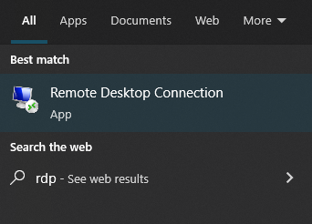
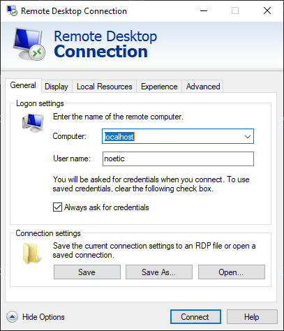
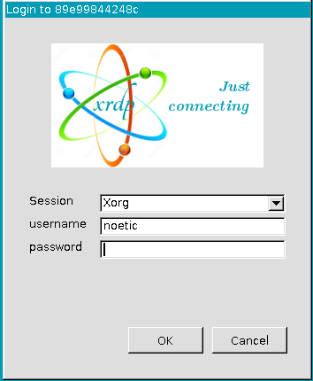

# Docker based ROS development environment
ROS noetic with Lubuntu desktop an RDP

## Usage
### Basic usage
In this mode there are no shared folders so the only way to save your work is using git and some external git service like GitHub. Keep in mind that with this method. Only internal editor like vim can be used to write code
```
docker run -p 3389:3389 -it -d javiercont97/ros-noetic-rdp:lubuntu bash
```
### Recommended usage
In this mode workspaces folder is shared. In this case just create a folder in host computer
```
mkdir workspaces
```
And then share that folder with `-v` flag like this
```
docker run -p 3389:3389 -it -d -v $(pwd)/workspaces:/home/noetic/Documents javiercont97/ros-noetic-rdp:lubuntu bash
```

### Connecting with RDP
First open RDP Client app



Then connect to `localhost` and use default credentials to login. These credentials are username noetic and password noetic.





